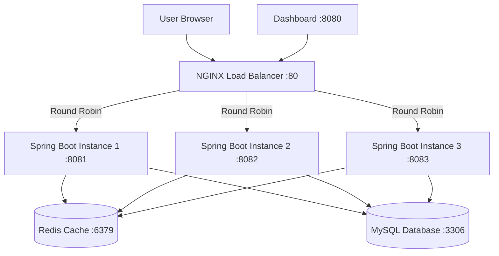

# Distributed Student Result Management System

A production-ready distributed Spring Boot 3.5.x backend application for managing student results with automatic grade calculation, pass/fail status determination, NGINX load balancing, Redis caching, and real-time monitoring dashboard.

## 🚀 Technology Stack

### Backend
- **Java Version**: 21
- **Spring Boot**: 3.5.0
- **Build Tool**: Maven
- **Database**: MySQL 8.0
- **ORM**: Spring Data JPA (Hibernate)
- **Cache**: Redis
- **Validation**: Jakarta Bean Validation
- **Documentation**: SpringDoc OpenAPI (Swagger)
- **Utilities**: Lombok, Spring Boot DevTools

### Infrastructure
- **Load Balancer**: NGINX
- **Containerization**: Docker & Docker Compose
- **Monitoring**: Custom Dashboard
- **Health Checks**: Spring Boot Actuator

### Frontend
- **Dashboard**: HTML5, CSS3, JavaScript
- **Charts**: Chart.js
- **Server**: Python HTTP Server

## 📋 Features

### Core Functionality
- **Student Management**: Complete CRUD operations for student records
- **Subject Management**: Complete CRUD operations for subject records
- **Result Management**: Complete CRUD operations for student results
- **Automatic Calculations**:
  - Total Marks = Internal Marks + External Marks
  - Grade Assignment (A+, A, B+, B, C, D, F)
  - Pass/Fail Status (>=35 PASS, <35 FAIL)
- **Validation**: Bean validation with custom error messages
- **Exception Handling**: Global exception handler with consistent error responses
- **API Documentation**: Swagger/OpenAPI 3.0 documentation
- **Logging**: Comprehensive logging throughout the application

### Distributed System Features
- **Multi-Instance Architecture**: 3 Spring Boot instances (8081, 8082, 8083)
- **NGINX Load Balancing**: Round-robin load distribution
- **Redis Caching**: Distributed caching for improved performance
- **Health Monitoring**: Real-time health checks for all instances
- **Response Metadata**: Instance tracking via custom headers
- **Dashboard**: Real-time monitoring with port distribution visualization
- **Bulk Testing**: Load testing with 10,000+ request support
- **Auto-Reset**: 24-hour automatic statistics reset
- **Persistence**: Stats persistence across page refreshes

### Database Schema

#### Students Table
- `student_id` (Primary Key, Auto Increment)
- `hall_ticket_no` (Unique, Not Null)
- `full_name` (Not Null)
- `gender` (Not Null)
- `date_of_birth` (Not Null)
- `email` (Unique, Not Null)
- `phone` (Not Null)
- `department` (Not Null)
- `year_of_study` (Not Null)
- `semester` (Not Null)
- `section` (Not Null)
- `created_at` (Auto Timestamp)

#### Subjects Table
- `subject_id` (Primary Key, Auto Increment)
- `subject_code` (Unique, Not Null)
- `subject_name` (Not Null)
- `department` (Not Null)
- `semester` (Not Null)
- `credits` (Not Null, > 0)

#### Results Table
- `result_id` (Primary Key, Auto Increment)
- `student_id` (Foreign Key to Students)
- `subject_id` (Foreign Key to Subjects)
- `internal_marks` (0-100, Not Null)
- `external_marks` (0-100, Not Null)
- `total_marks` (Auto Calculated)
- `grade` (Auto Calculated)
- `result_status` (Auto Calculated)

## 🏗️ System Architecture



## 🏗️ Project Structure

```
student-result-management/
├── src/
│   ├── main/
│   │   ├── java/com/studentresult/
│   │   │   ├── config/
│   │   │   │   ├── CorsConfig.java
│   │   │   │   ├── OpenApiConfig.java
│   │   │   │   └── RedisConfig.java
│   │   │   ├── controller/
│   │   │   │   ├── StudentController.java
│   │   │   │   ├── SubjectController.java
│   │   │   │   └── ResultController.java
│   │   │   ├── dto/
│   │   │   │   ├── StudentRequestDto.java
│   │   │   │   ├── StudentResponseDto.java
│   │   │   │   ├── SubjectRequestDto.java
│   │   │   │   ├── SubjectResponseDto.java
│   │   │   │   ├── ResultRequestDto.java
│   │   │   │   └── ResultResponseDto.java
│   │   │   ├── entity/
│   │   │   │   ├── Student.java
│   │   │   │   ├── Subject.java
│   │   │   │   └── Result.java
│   │   │   ├── exception/
│   │   │   │   ├── GlobalExceptionHandler.java
│   │   │   │   └── ResourceNotFoundException.java
│   │   │   ├── filter/
│   │   │   │   └── ResponseMetadataFilter.java
│   │   │   ├── repository/
│   │   │   │   ├── StudentRepository.java
│   │   │   │   ├── SubjectRepository.java
│   │   │   │   └── ResultRepository.java
│   │   │   ├── response/
│   │   │   │   └── ApiResponse.java
│   │   │   ├── service/
│   │   │   │   ├── StudentService.java
│   │   │   │   ├── SubjectService.java
│   │   │   │   ├── ResultService.java
│   │   │   │   └── impl/
│   │   │   │       ├── StudentServiceImpl.java
│   │   │   │       ├── SubjectServiceImpl.java
│   │   │   │       └── ResultServiceImpl.java
│   │   │   ├── util/
│   │   │   │   └── Constants.java
│   │   │   └── StudentResultManagementApplication.java
│   │   └── resources/
│   │       └── application.properties
├── dashboard/
│   ├── index.html
│   ├── script.js
│   ├── api.js
│   ├── utils.js
│   └── charts.js
├── nginx.conf
├── nginx-docker-compose.yml
├── pom.xml
└── README.md
```

## 🛠️ Prerequisites

- Java 21 or higher
- Maven 3.6 or higher
- MySQL 8.0 or higher
- Docker & Docker Compose
- Python 3.x (for dashboard server)
- IDE (IntelliJ IDEA, Eclipse, or VS Code)

## 📦 Installation

### Option 1: Docker Deployment (Recommended)

#### 1. Clone the Project
```bash
git clone https://github.com/siva071/distributed-student-result-management-system.git
cd distributed-student-result-management-system
```

#### 2. Start All Services
```bash
docker-compose -f nginx-docker-compose.yml up -d
```

This will start:
- NGINX Load Balancer (port 80)
- 3 Spring Boot instances (ports 8081, 8082, 8083)
- Redis Cache (port 6379)
- MySQL Database (port 3306)

#### 3. Start Dashboard
```bash
cd dashboard
python -m http.server 8080
```

Access the dashboard at: http://localhost:8080

### Option 2: Manual Deployment

#### 1. Configure Database
Create a MySQL database named `student_results`:
```sql
CREATE DATABASE student_results;
```

#### 2. Update Database Credentials
Edit `src/main/resources/application.properties` and update the MySQL password:
```properties
spring.datasource.password=your_password_here
```

#### 3. Build the Project
```bash
mvn clean install
```

#### 4. Run Multiple Instances
```bash
# Instance 1
mvn spring-boot:run -Dserver.port=8081

# Instance 2 (in separate terminal)
mvn spring-boot:run -Dserver.port=8082

# Instance 3 (in separate terminal)
mvn spring-boot:run -Dserver.port=8083
```

#### 5. Start Redis
```bash
docker run -d -p 6379:6379 redis:latest
```

#### 6. Configure NGINX
Copy `nginx.conf` to your NGINX configuration and restart NGINX.

#### 7. Start Dashboard
```bash
cd dashboard
python -m http.server 8080
```

## 🌐 API Endpoints

### Base URL
```
http://localhost (via NGINX)
http://localhost:8081 (Instance 1)
http://localhost:8082 (Instance 2)
http://localhost:8083 (Instance 3)
```

### Student Endpoints

| Method | Endpoint | Description |
|--------|----------|-------------|
| GET | `/api/students` | Get all students |
| GET | `/api/students/{id}` | Get student by ID |
| POST | `/api/students` | Create a new student |
| PUT | `/api/students/{id}` | Update a student |
| DELETE | `/api/students/{id}` | Delete a student |

### Subject Endpoints

| Method | Endpoint | Description |
|--------|----------|-------------|
| GET | `/api/subjects` | Get all subjects |
| GET | `/api/subjects/{id}` | Get subject by ID |
| POST | `/api/subjects` | Create a new subject |
| PUT | `/api/subjects/{id}` | Update a subject |
| DELETE | `/api/subjects/{id}` | Delete a subject |

### Result Endpoints

| Method | Endpoint | Description |
|--------|----------|-------------|
| GET | `/api/results` | Get all results |
| GET | `/api/results/{id}` | Get result by ID |
| POST | `/api/results` | Create a new result |
| PUT | `/api/results/{id}` | Update a result |
| DELETE | `/api/results/{id}` | Delete a result |

## 📚 API Documentation

### Swagger UI
Access the interactive API documentation at:
```
http://localhost:8081/swagger-ui.html
http://localhost:8082/swagger-ui.html
http://localhost:8083/swagger-ui.html
```

### OpenAPI JSON
Access the OpenAPI specification at:
```
http://localhost:8081/api-docs
http://localhost:8082/api-docs
http://localhost:8083/api-docs
```

### Health Check Endpoints
```
http://localhost:8081/actuator/health
http://localhost:8082/actuator/health
http://localhost:8083/actuator/health
```

## 🧪 Testing with Postman

### Example: Create a Student

**Request:**
```http
POST http://localhost/api/students
Content-Type: application/json

{
  "hallTicketNo": "2024CS001",
  "fullName": "John Doe",
  "gender": "Male",
  "dateOfBirth": "2000-05-15",
  "email": "john.doe@example.com",
  "phone": "9876543210",
  "department": "Computer Science",
  "yearOfStudy": 3,
  "semester": 5,
  "section": "A"
}
```

**Response:**
```json
{
  "studentId": 1,
  "hallTicketNo": "2024CS001",
  "fullName": "John Doe",
  "gender": "Male",
  "dateOfBirth": "2000-05-15",
  "email": "john.doe@example.com",
  "phone": "9876543210",
  "department": "Computer Science",
  "yearOfStudy": 3,
  "semester": 5,
  "section": "A",
  "createdAt": "2024-01-15T10:30:00"
}
```

### Example: Create a Subject

**Request:**
```http
POST http://localhost:8080/api/subjects
Content-Type: application/json

{
  "subjectCode": "CS501",
  "subjectName": "Data Structures",
  "department": "Computer Science",
  "semester": 5,
  "credits": 4
}
```

### Example: Create a Result

**Request:**
```http
POST http://localhost:8080/api/results
Content-Type: application/json

{
  "studentId": 1,
  "subjectId": 1,
  "internalMarks": 35,
  "externalMarks": 45
}
```

**Response:**
```json
{
  "resultId": 1,
  "studentId": 1,
  "studentName": "John Doe",
  "subjectId": 1,
  "subjectName": "Data Structures",
  "internalMarks": 35,
  "externalMarks": 45,
  "totalMarks": 80,
  "grade": "A",
  "resultStatus": "PASS"
}
```

## 🎯 Grade Calculation Logic

| Total Marks | Grade | Status |
|-------------|-------|--------|
| >= 90 | A+ | PASS |
| >= 80 | A | PASS |
| >= 70 | B+ | PASS |
| >= 60 | B | PASS |
| >= 50 | C | PASS |
| >= 35 | D | PASS |
| < 35 | F | FAIL |

## ✅ Validation Rules

### Student Validation
- Hall Ticket Number: Required, Unique
- Full Name: Required
- Gender: Required
- Date of Birth: Required, Must be in the past
- Email: Required, Valid email format, Unique
- Phone: Required
- Department: Required
- Year of Study: Required
- Semester: Required
- Section: Required

### Subject Validation
- Subject Code: Required, Unique
- Subject Name: Required
- Department: Required
- Semester: Required
- Credits: Required, Must be greater than zero

### Result Validation
- Student ID: Required, Must exist
- Subject ID: Required, Must exist
- Internal Marks: Required, Must be between 0 and 100
- External Marks: Required, Must be between 0 and 100

## 🔒 Error Handling

The application uses a global exception handler that provides consistent error responses:

### 404 Not Found
```json
{
  "status": 404,
  "message": "Student not found with ID: 1",
  "timestamp": "2024-01-15T10:30:00"
}
```

### 400 Bad Request (Validation Error)
```json
{
  "status": 400,
  "message": "Validation failed",
  "timestamp": "2024-01-15T10:30:00",
  "errors": {
    "email": "Email must be valid",
    "hallTicketNo": "Hall ticket number cannot be null"
  }
}
```

### 500 Internal Server Error
```json
{
  "status": 500,
  "message": "An unexpected error occurred",
  "timestamp": "2024-01-15T10:30:00"
}
```

## 🏛️ Architecture Principles

- **SOLID Principles**: Single Responsibility, Open/Closed, Liskov Substitution, Interface Segregation, Dependency Inversion
- **Clean Architecture**: Separation of concerns with distinct layers (Controller, Service, Repository)
- **Constructor Injection**: Dependency injection via constructors for better testability
- **DTO Pattern**: Data Transfer Objects for clean API contracts
- **Exception Handling**: Centralized exception handling with @RestControllerAdvice
- **Logging**: Comprehensive logging using SLF4J with Lombok's @Slf4j
- **Load Balancing**: NGINX round-robin distribution across multiple instances
- **Caching**: Redis-based distributed caching for improved performance
- **Monitoring**: Real-time dashboard with health checks and metrics

## 📊 Dashboard Features

The monitoring dashboard provides real-time insights into the distributed system:

### Dashboard Sections
- **Dashboard Overview**: Overall statistics (completed requests, failed requests, response times)
- **Port Distribution**: Visual representation of load distribution across instances (8081, 8082, 8083)
- **Health Monitor**: Real-time health status of all instances with response times
- **Single Test**: Test individual API requests and view detailed response metadata
- **Bulk Test**: Load testing with configurable request counts (supports 10,000+ requests)
- **Logs**: Request/response logs with timestamps and metadata
- **Analytics**: Performance metrics and charts
- **Architecture Visualization**: Visual representation of the system architecture

### Dashboard Features
- **Auto-Reset**: Statistics automatically reset after 24 hours
- **Persistence**: Statistics persist across page refreshes (localStorage)
- **Chunked Processing**: Bulk tests process requests in chunks to prevent overload
- **Response Metadata**: Custom headers track which instance handled each request
- **Real-time Updates**: Live updates for health checks and statistics

## ⚖️ Load Balancing Demo

### NGINX Configuration
The NGINX load balancer uses round-robin distribution across three Spring Boot instances:

```nginx
upstream student_backend {
    server student-app-1:8081;
    server student-app-2:8082;
    server student-app-3:8083;
}
```

### Response Headers
Each API response includes custom headers for tracking:
- `X-Served-By`: Port number of the serving instance
- `X-Instance`: Instance name
- `X-Hostname`: Hostname of the server
- `X-Response-Time`: Response timestamp

### Testing Load Distribution
Use the dashboard bulk test feature to send multiple requests and observe the balanced distribution across all three instances.

## 📝 Configuration

### application.properties
```properties
# Database Configuration - Supports Docker environment variables
spring.datasource.url=${SPRING_DATASOURCE_URL:jdbc:mysql://localhost:3306/student_results}
spring.datasource.username=${SPRING_DATASOURCE_USERNAME:root}
spring.datasource.password=${SPRING_DATASOURCE_PASSWORD:your_password_here}
spring.datasource.driver-class-name=com.mysql.cj.jdbc.Driver

# JPA/Hibernate Configuration
spring.jpa.hibernate.ddl-auto=update
spring.jpa.show-sql=true
spring.jpa.properties.hibernate.format_sql=true
spring.jpa.database-platform=org.hibernate.dialect.MySQLDialect

# Redis Configuration - Supports Docker environment variables
spring.data.redis.host=${SPRING_DATA_REDIS_HOST:localhost}
spring.data.redis.port=${SPRING_DATA_REDIS_PORT:6379}

# Cache Configuration
spring.cache.type=redis
spring.cache.redis.time-to-live=600000

# Server Configuration - Supports Docker environment variables
server.port=${SERVER_PORT:8080}

# CORS Configuration
spring.web.cors.allowed-origins=*
spring.web.cors.allowed-methods=*
spring.web.cors.allowed-headers=*
```

## 🚀 Deployment

### Docker Deployment (Recommended)
```bash
# Build and start all services
docker-compose -f nginx-docker-compose.yml up -d

# View logs
docker-compose -f nginx-docker-compose.yml logs -f

# Stop services
docker-compose -f nginx-docker-compose.yml down
```

### Build for Production
```bash
mvn clean package -DskipTests
```

### Run JAR File
```bash
java -jar target/student-result-management-1.0.0.jar
```

## 📸 Screenshots

### Dashboard Overview
- Real-time statistics display
- Port distribution visualization
- Health monitoring for all instances

### Load Balancing
- Balanced request distribution across instances
- Response time tracking
- Instance metadata display

### Bulk Testing
- Configurable request counts
- Progress tracking
- Performance metrics

## 🔮 Future Improvements

- [ ] Add authentication and authorization
- [ ] Implement rate limiting
- [ ] Add circuit breaker pattern
- [ ] Implement distributed tracing
- [ ] Add Prometheus metrics integration
- [ ] Implement database sharding
- [ ] Add WebSocket support for real-time updates
- [ ] Implement API versioning
- [ ] Add comprehensive unit and integration tests
- [ ] Implement CI/CD pipeline

## 📄 License

This project is licensed under the MIT License.

## � Author

**Bonthala Siva Shankar**
- GitHub: [@siva071](https://github.com/siva071)
- Portfolio: Fresh Digital Creations

## 🙏 Acknowledgments

- Spring Boot Team
- Spring Data JPA Team
- SpringDoc OpenAPI Team
- NGINX Team
- Redis Team
- Docker Team
